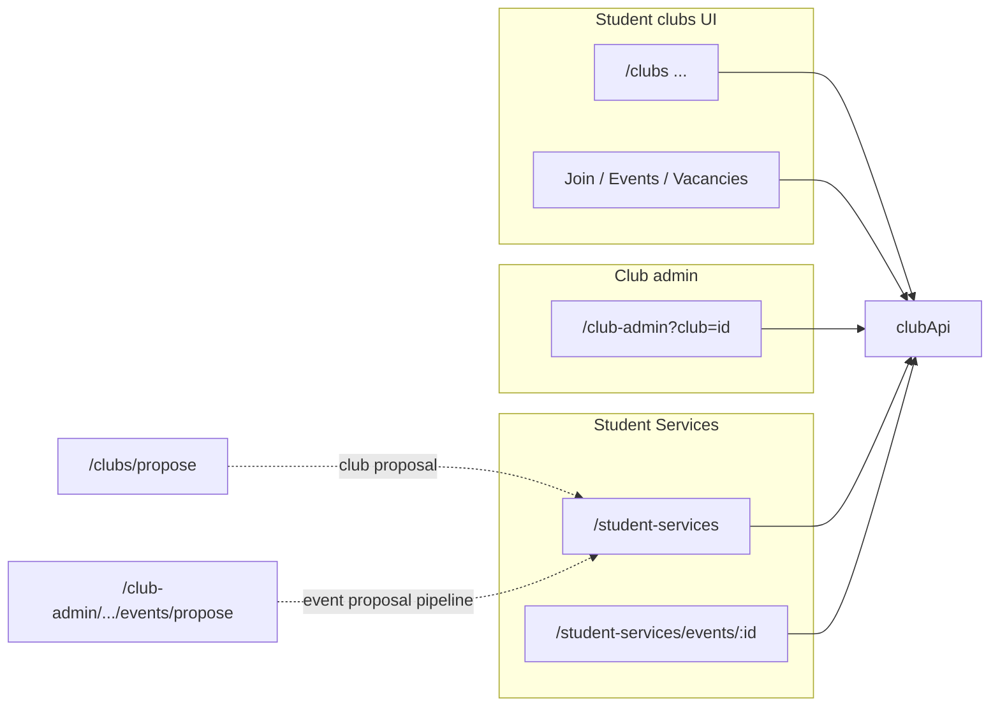

# Club, Club Admin, and Student Services — Feature Map

This document lists routes and user-facing features implemented in the FrontWeb app for **student club browsing**, **club administration**, and **Student Services** oversight. It reflects the codebase as of the current branch.

---

## How the three areas connect

| Area | Role | Typical flow |
|------|------|----------------|
| **Clubs (student)** | Students discover clubs, apply to join, browse vacancies and events, register for events. | Data comes from `clubApi` (`fetchClubs`, `fetchClub`, `fetchEvents`, `fetchVacancies`, etc.). Proposals submitted via **Propose Club** may later appear in **Student Services** as proposals to approve. |
| **Club admin** | Club officers/staff manage *their* club (`?club=<id>` on all `/club-admin/*` URLs). | Same backend family (`clubApi` club-admin endpoints). Admins post announcements (notifications), review applications, manage vacancies, events, members, positions, interview slots. **JWT Admin** role can open any club by id; others need a managing membership verified via `fetchClubAdminDashboard`. |
| **Student Services** | Institution staff approve **club** and **event** proposals, maintain a **directory** of approved clubs, and manage **approved events** (including creating events, often auto-confirmed). | Uses `clubApi` student-services endpoints (`fetchStudentServicesClubProposals`, `approveStudentServicesClubProposal`, `fetchStudentServicesEvents`, `createStudentServicesEvent`, etc.). Approved events can be opened at `/student-services/events/:id`. |

**Shared technical pieces**

- **`src/api/clubApi.js`** — HTTP layer for clubs, events, vacancies, admin, and student services.
- **`src/api/clubMappers.js`** (and `clubAdminMappers.js`, `clubApplicationMappers.js`) — API response mapping.
- **`RegisteredEventsContext`** — Client-side event registration state; **EventDetail** / **MyRegisteredEvents** also sync with `fetchMyEventRegistrations` / `registerForEvent`.
- **`ClubAdminAccessContext`** — Exposes `clubId`, query string, and access state to nested admin routes.

---

## Routes (from `App.jsx`)

### Student — clubs & related

| Path | Components / notes |
|------|---------------------|
| `/clubs` | **ClubsList** — search, category filter, paginated club cards from API. |
| `/clubs/:id` | **ClubDetail** — tabs: About, Announcements, Members, Resources; hero, social links, upcoming events, join CTA. |
| `/clubs/:id/join` | **ClubDetail** + **JoinClub** overlay — letter of purpose, portfolio links/files, `submitClubJoinApplication`. |
| `/clubs/propose` | **ProposeClub** — multi-step wizard; `submitClubProposal`; draft cookie. |
| `/clubs/notifications` | **ClubNotifications** — tabs (All, Club Proposals, Membership, Vacancies, Events); API notifications + `markClubNotificationRead`. |
| `/clubs/my-memberships` | **MyMemberships** — memberships, membership applications, vacancy applications (`fetchMyClubMemberships`, etc.). |
| `/clubs/vacancies` | **ClubVacancies** — grid/list, search, category filter, saved vacancies (cookie), pagination. |
| `/clubs/vacancies/:id` | **ClubVacancies** + **VacancyDetail** — full vacancy, save toggle, apply CTA. |
| `/clubs/vacancies/:id/apply` | **ClubVacancies** + **ApplyVacancy** — purpose text, CV upload, `submitVacancyApplication`. |
| `/clubs/vacancies/my-applications` | **MyVacancyApplications** — status of job applications. |
| `/clubs/events` | **ClubEvents** — list/grid, search, optional `?club=`, “my clubs” filter, loads `fetchEvents`. |
| `/clubs/events/:id` | **ClubEvents** + **EventDetail** — event info, sub-events, register / registered state, link to ticket. |
| `/clubs/events/:id/ticket` | **EventTicket** — registration confirmation view, `fetchEventTicket`. |
| `/clubs/events/my-registrations` | **MyRegisteredEvents** — upcoming/past tabs; merges API registrations with local context. |

### Club admin (`/club-admin?club=<numericId>`)

Layout: **ClubAdminLayout** — club picker (memberships or manual id), access check, sidebar nav, **New Announcement** modal (`postClubAdminAnnouncement`), `Outlet` for child routes.

| Path | Page | Highlights |
|------|------|------------|
| `/club-admin` | **ClubAdminDashboard** | Stats (members, vacancies, applications, events), recent application activity. |
| `/club-admin/applications` | **ClubAdminApplications** | Tabs: membership vs job applications; search/filters; bulk actions; detail overlay **ClubAdminApplicationDetail**; approve / reject / request changes / notes; link to **Interview times**. |
| `/club-admin/interview-times` | **ClubAdminInterviewTimes** | Generate/edit/delete interview slots; tied to vacancies. |
| `/club-admin/vacancies` | **ClubAdminVacancies** | List/edit vacancy status; link to create new. |
| `/club-admin/vacancies/new` | **ClubAdminNewVacancy** | Create vacancy. |
| `/club-admin/events` | **ClubAdminEvents** | Club events management. |
| `/club-admin/events/propose` | **ClubAdminSuggestEvent** | Multi-step event proposal to institution (`proposeClubAdminEvent`); draft cookie; aligns with Student Services venue list. |
| `/club-admin/members` | **ClubAdminMembers** | **Members** and **Employees** sub-tabs (roster, search, removals). |
| `/club-admin/employees` | **ClubAdminEmployees** | Dedicated employees list: position edits, save, remove (also overlaps Members page tab). |
| `/club-admin/profile` | **ClubAdminProfile** | Edit club profile (images, focus areas, icons, etc.); `patchClubAdminProfile`. |
| `/club-admin/positions` | **ClubAdminPositions** | Club-defined positions. |
| `/club-admin/positions/new` | **ClubAdminNewPosition** | Create position. |

**Access:** Query `club` is required. Non–JWT-admins must pass `fetchClubAdminDashboard` check for that id.

### Student Services

| Path | Page | Highlights |
|------|------|------------|
| `/student-services` | **StudentServices** | Large single page with sidebar sections (see below). |
| `/student-services/events/:id` | **StudentServicesEventDetail** | Read-only event detail; can hydrate from `location.state` or `getStudentServicesEvent`; back navigates with `{ section: 'events' }`. |

**Student Services — sidebar sections** (`section` state)

1. **Command Center** — Aggregated “master directory” style UI: club rows, pagination, drill-in with tabs **Members** / **Employees** / **Settings** (local mock-style management: add/remove, edit name/status/image). Sub-tabs under command for clubs vs activity overview (see in-file `commandTab`).
2. **Club Proposals** — List/detail for incoming club proposals: approve, reject, request revision; configurable **requirements** list + deadline modal (`fetchStudentServicesProposalRequirements`, etc.).
3. **Event Proposals** — Review club-submitted event proposals: approve / reject / revision; room assignment concepts (`eventRoomAssignments`).
4. **Clubs** — Approved clubs directory (API-backed when available).
5. **Events** — Approved events: filters (upcoming / past / all), search, edit approved event metadata, **Add Event** wizard (full fields + sub-events, logistics flags, draft cookie), navigation to detail route.

**Note:** `renderStaffManagement()` exists for `section === 'staff'` but the sidebar does not expose a Staff item, so that branch is not reachable from the default UI unless `section` is set programmatically.

**Footer:** Links to IT Support with `state.from` = `student-services`; Logout button (placeholder).

---

## Student club pages — feature checklist

- **ClubsList:** API categories; search; category chip; infinite-style paging; error states.
- **ClubDetail:** Member detection via `fetchMyClubMemberships`; announcements; officers/focus areas; resources (e.g. PDF); social links; quick links to vacancies/events/propose; **Join** if not a member.
- **JoinClub:** FormData application with letter + optional portfolio.
- **ProposeClub:** Four steps, validation (e.g. alignment word count), draft persistence.
- **ClubNotifications:** Type filters; read/unread via API.
- **MyMemberships:** Unified hub for clubs + application pipelines (plus mock fallbacks from `clubsData` where used).
- **ClubVacancies / VacancyDetail / ApplyVacancy:** Discovery, bookmark cookie, detailed benefits UI, job application with CV.
- **ClubEvents / EventDetail:** Registration with `RegisteredEventsContext` + server registration; ticket route.
- **MyRegisteredEvents / MyVacancyApplications:** Personal tracking lists.

---

## Club admin — feature checklist

- Global **announcement → notification** broadcast for the active club.
- **Dashboard** analytics and activity feed.
- **Applications** pipeline for membership and jobs, with detail drawer and interview scheduling entry point.
- **Interview times** slot generation and CRUD.
- **Vacancies** lifecycle and **Positions** CRUD; **New vacancy** form.
- **Events** listing + **Suggest event** wizard (institutional proposal).
- **Members** roster + **Employees** (positions, bulk save, remove) — duplicated in part on standalone **Employees** page.
- **Club profile** rich editing.

---

## Student Services — feature checklist

- API refresh on load merges real data into UI; falls back to seeded mocks if calls fail.
- **Club proposal** and **event proposal** approval workflows with modals.
- **Requirements** editor for new club criteria (stored via API when available).
- **Directory** and **approved events** CRUD-style editing; **Add Event** mirrors club-admin complexity; cookie draft for long forms.
- Deep link from event list to `/student-services/events/:id`.

---

## Files to read for deeper detail

| Concern | Primary files |
|---------|----------------|
| Routing | `src/App.jsx` |
| Club API | `src/api/clubApi.js`, `src/api/clubConfig.js` |
| Admin access / layout | `src/pages/club-admin/ClubAdminLayout.jsx`, `src/hooks/useClubAdminClubId.js`, `src/auth/jwtRoles.js` |
| Student Services | `src/pages/StudentServices.jsx`, `src/pages/StudentServicesEventDetail.jsx` |

---

*Generated from static analysis of the FrontWeb repository.*
